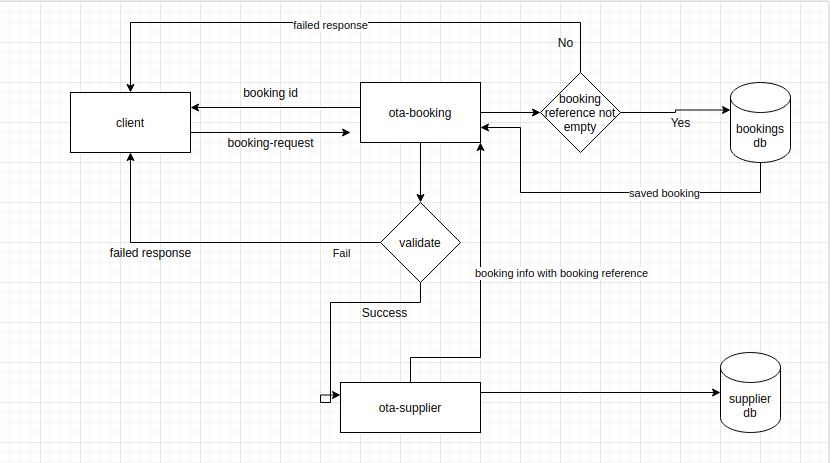
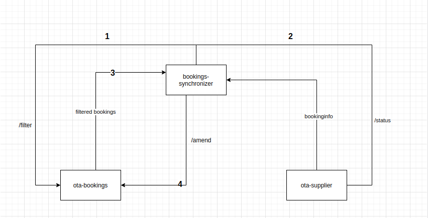

# ota-bookings-system

System consists of 3 main services:

1. [ota-booking](https://github.com/raju4789/ota-booking)
2. [supplier](https://github.com/raju4789/ota-supplier )
3. [bookings-synchronizer](https://github.com/raju4789/bookings-synchronizer)


Above services communicate among each other to work as a single application to book hotel rooms.
For more info read README of respective project.

## Application flows:

### Flow 1:



### Flow 2: 



## Run application in docker container:

Execute below commands from project directory.

**NOTE:**

1. Execute below comands in the same order as specified.
2. Below code is compiled and executed Ubuntu 20.04.

#### Build ota-booking:

```
sudo docker build . -f Dockerfile -t ota-booking
```

####  Build ota-supplier:

```
sudo docker build . -f Dockerfile -t ota-supplier
```

####  Build bookings-synchronizer:

```
sudo docker build . -f Dockerfile -t bookings-synchronizer
```

####  Run database ogado-mysql:

```
sudo docker run --name ogado-mysql -e MYSQL_ROOT_PASSWORD=Raju@4789 -e MYSQL_DATABASE=ogado -e MYSQL_USER=admin   -e MYSQL_PASSWORD=Raju@4789 -d mysql:8.0.22
```

####  Run database supplier-mysql:

```
sudo docker run --name supplier-mysql -e MYSQL_ROOT_PASSWORD=Raju@4789 -e MYSQL_DATABASE=supplier -e MYSQL_USER=admin   -e MYSQL_PASSWORD=Raju@4789 -d mysql:8.0.22
```


####  Run ota-supplier:

```
sudo docker run -p 8082:8082 --name ota-supplier --link  supplier-mysql:mysql -d ota-supplier 
```

####  Run ota-booking:


```
sudo docker run -p 8081:8081 --name ota-booking --link ota-supplier  --link  ogado-mysql:mysql  -d ota-booking 
```

####  Run bookings-synchronizer:


```
sudo docker run --name bookings-synchronizer --link ota-supplier --link ota-booking  -d bookings-synchronizer
```

## Run application in locally:

**NOTE:**

1. Execute below commands in mysql console preferably 8.0.19.

####  Create database ogado:

```
 CREATE DATABASE ogado;
```

####  Create databasesupplier:

```
CREATE DATABASE supplier;
```

**NOTE:**

1. Execute below commands from project directory.

**NOTE:**

1. Below code is compiled and executed Ubuntu 20.04.


#### Build ota-booking:

```
mvn clean install -DskipTests
```

####  Build ota-supplier:

```
mvn clean install -DskipTests
```

####  Build bookings-synchronizer:

```
mvn clean install -DskipTests
```


####  Run ota-supplier:

```
mvn exec:java -Denv=dev
```

####  Run ota-booking:


```
mvn exec:java -Denv=dev
```

####  Run bookings-synchronizer:


```
mvn exec:java -Denv=dev
```


